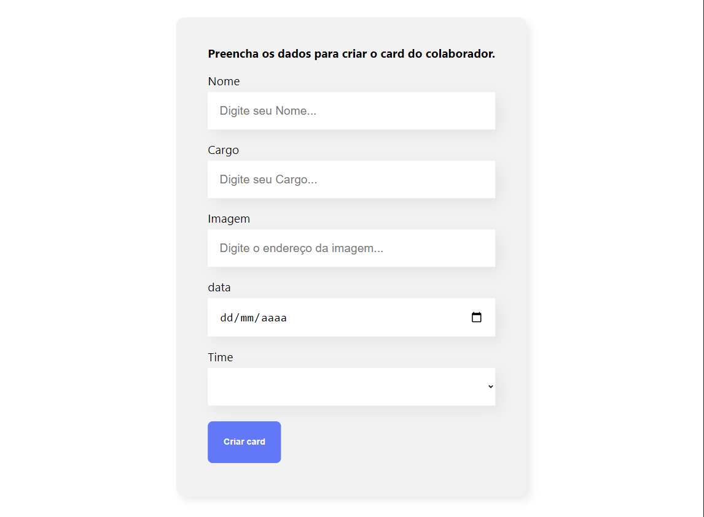
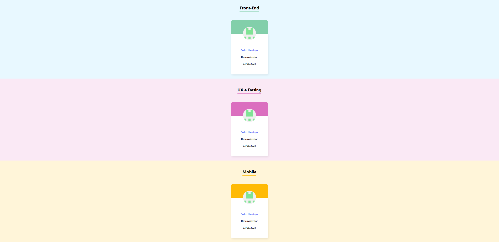

# Organo

```
Pagina desenvolvida utilizando o React para gerar um organograma da empresa.
```

 # Tecnologias utilizadas no projeto
 * React
 * TypeScript
 * NodeJS

# Algumas imagens do projeto!!

 
 Banner

 
 Formulário de aplicação do organo

 
 Lista com os colaboradores após serem submetidos no formulário